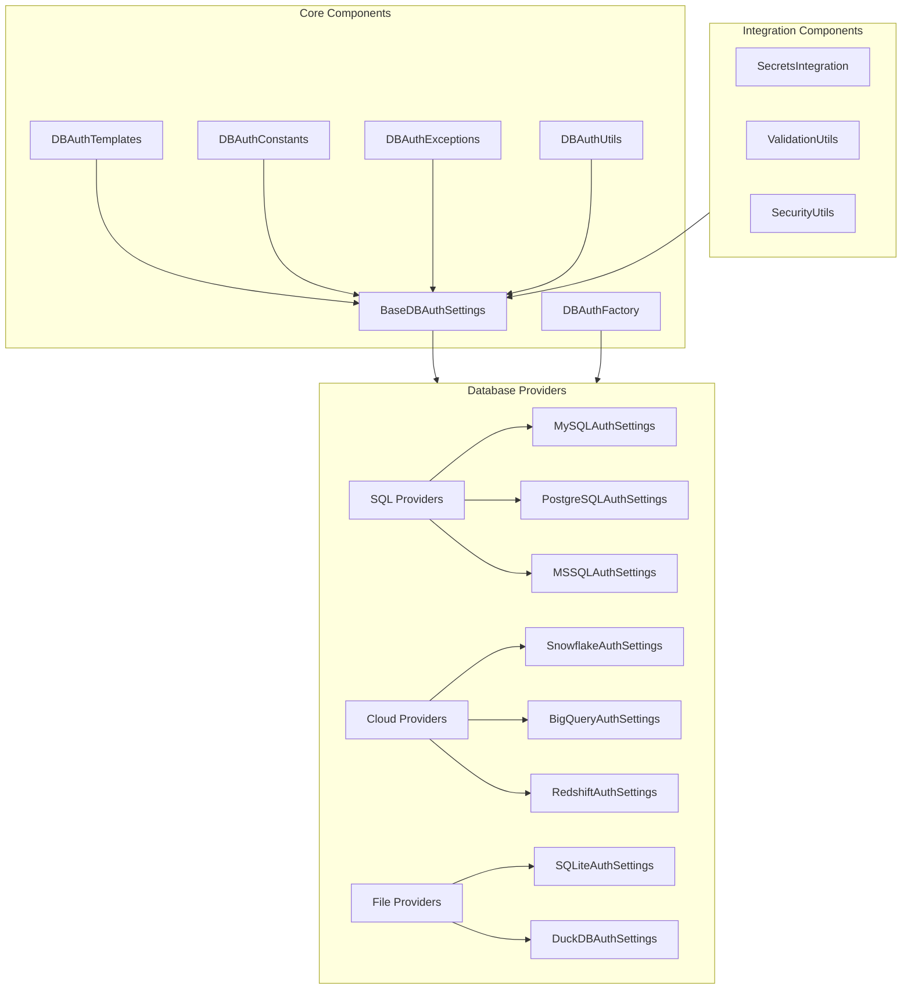

# Database Authentication System Architecture

## 1. High-Level Architecture



## 2. File Structure

```plaintext
mountainash_settings/auth/database/
├── __init__.py
├── base.py                    # Base authentication classes
├── templates.py              # Connection string templates
├── constants.py              # Constants and enums
├── exceptions.py             # Exception classes
├── factory.py               # Provider factory
├── utils/
│   ├── __init__.py
│   ├── validation.py        # Validation utilities
│   ├── security.py         # Security utilities
│   └── connection.py       # Connection utilities
├── providers/
│   ├── __init__.py
│   ├── sql/
│   │   ├── __init__.py
│   │   ├── mysql.py
│   │   ├── postgresql.py
│   │   └── mssql.py
│   ├── cloud/
│   │   ├── __init__.py
│   │   ├── snowflake.py
│   │   ├── bigquery.py
│   │   └── redshift.py
│   └── file/
│       ├── __init__.py
│       ├── sqlite.py
│       └── duckdb.py
└── integration/
    ├── __init__.py
    ├── secrets.py
    └── security.py
```

## 3. Core Components

### 3.1 Base Classes

```python
# base.py
class BaseDBAuthSettings(MountainAshBaseSettings):
    """Base class for database authentication settings"""
    
    # Provider Configuration
    PROVIDER_TYPE: str
    AUTH_METHOD: str
    
    # Connection Settings
    HOST: Optional[str]
    PORT: Optional[int]
    DATABASE: Optional[str]
    
    # Authentication
    USERNAME: Optional[str]
    PASSWORD: Optional[SecretStr]
    
    # Security
    SSL_ENABLED: bool = True
    SSL_VERIFY: bool = True
    SSL_CA: Optional[str]
    SSL_CERT: Optional[str]
    SSL_KEY: Optional[str]
    
    # Connection Pool
    POOL_SIZE: Optional[int]
    POOL_TIMEOUT: Optional[int]
    
    # Integration
    SECRETS_NAMESPACE: Optional[str]
    
    @abstractmethod
    def get_connection_string(self) -> str:
        """Generate connection string from settings"""
        pass
    
    @abstractmethod
    def validate_connection(self) -> bool:
        """Validate connection parameters"""
        pass
```

### 3.2 Constants

```python
# constants.py
class CONST_DB_PROVIDER_TYPE(BaseConstant):
    """Database provider types"""
    MYSQL = "mysql"
    POSTGRESQL = "postgresql"
    MSSQL = "mssql"
    SNOWFLAKE = "snowflake"
    BIGQUERY = "bigquery"
    REDSHIFT = "redshift"
    SQLITE = "sqlite"
    DUCKDB = "duckdb"

class CONST_DB_AUTH_METHOD(BaseConstant):
    """Authentication methods"""
    PASSWORD = "password"
    IAM = "iam"
    TOKEN = "token"
    CERTIFICATE = "certificate"
    WINDOWS = "windows"
```

### 3.3 Templates

```python
# templates.py
class DBAuthTemplates(BaseSettings):
    """Templates for database connections"""
    
    MYSQL_TEMPLATE: str = "mysql://{USERNAME}:{PASSWORD}@{HOST}:{PORT}/{DATABASE}"
    POSTGRESQL_TEMPLATE: str = "postgresql://{USERNAME}:{PASSWORD}@{HOST}:{PORT}/{DATABASE}"
    SNOWFLAKE_TEMPLATE: str = "snowflake://{USERNAME}:{PASSWORD}@{ACCOUNT}/{DATABASE}"
    BIGQUERY_TEMPLATE: str = "bigquery://{PROJECT_ID}/{DATASET}"
```

## 4. Provider Classes

### 4.1 SQL Providers

```python
# providers/sql/mysql.py
class MySQLAuthSettings(BaseDBAuthSettings):
    """MySQL authentication settings"""
    
    PROVIDER_TYPE: str = CONST_DB_PROVIDER_TYPE.MYSQL
    PORT: int = 3306
    
    # MySQL specific
    ALLOW_LOCAL_INFILE: bool = False
    CHARSET: str = "utf8mb4"
    
    def get_connection_string(self) -> str:
        return self.format_template_from_settings(
            DBAuthTemplates().MYSQL_TEMPLATE
        )
```

### 4.2 Cloud Providers

```python
# providers/cloud/snowflake.py
class SnowflakeAuthSettings(BaseDBAuthSettings):
    """Snowflake authentication settings"""
    
    PROVIDER_TYPE: str = CONST_DB_PROVIDER_TYPE.SNOWFLAKE
    
    # Snowflake specific
    ACCOUNT: str
    WAREHOUSE: str
    ROLE: Optional[str]
    
    def get_connection_string(self) -> str:
        return self.format_template_from_settings(
            DBAuthTemplates().SNOWFLAKE_TEMPLATE
        )
```

## 5. Integration Components

### 5.1 Secrets Integration

```python
# integration/secrets.py
class DBSecretsIntegration:
    """Integration with Mountain Ash secrets system"""
    
    def __init__(self, auth_settings: BaseDBAuthSettings):
        self.auth_settings = auth_settings
        self.secrets_manager = get_secrets_manager()
    
    def get_credentials(self) -> Dict[str, Any]:
        """Retrieve credentials from secret store"""
        if not self.auth_settings.SECRETS_NAMESPACE:
            raise ValueError("Secrets namespace not configured")
            
        return {
            "username": self.secrets_manager.get_secret(
                f"{self.auth_settings.SECRETS_NAMESPACE}/username"
            ),
            "password": self.secrets_manager.get_secret(
                f"{self.auth_settings.SECRETS_NAMESPACE}/password"
            )
        }
```

## 6. Factory Pattern Implementation

```python
# factory.py
class DBAuthFactory:
    """Factory for creating database authentication settings"""
    
    @staticmethod
    def create_auth_settings(
        provider_type: str,
        settings_namespace: str,
        config_files: Optional[Union[UPath, str, List[UPath|str]]] = None,
        **kwargs
    ) -> BaseDBAuthSettings:
        """Create appropriate auth settings instance"""
        
        provider_map = {
            CONST_DB_PROVIDER_TYPE.MYSQL: MySQLAuthSettings,
            CONST_DB_PROVIDER_TYPE.POSTGRESQL: PostgreSQLAuthSettings,
            CONST_DB_PROVIDER_TYPE.SNOWFLAKE: SnowflakeAuthSettings,
            # ... other providers
        }
        
        settings_class = provider_map.get(provider_type)
        if not settings_class:
            raise ValueError(f"Unknown provider type: {provider_type}")
        
        settings_parameters = prepare_settings_parameters(
            settings_namespace=settings_namespace,
            settings_class=settings_class,
            config_files=config_files,
            **kwargs
        )
        
        return get_settings(settings_parameters=settings_parameters)
```

## 7. Usage Examples

```python
# Example usage
from mountainash_settings.auth.database import DBAuthFactory

# MySQL Example
mysql_auth = DBAuthFactory.create_auth_settings(
    provider_type="mysql",
    settings_namespace="prod_mysql",
    HOST="db.example.com",
    PORT=3306,
    DATABASE="mydb",
    USERNAME="user",
    PASSWORD="pass"
)

# Snowflake Example with Secrets
snowflake_auth = DBAuthFactory.create_auth_settings(
    provider_type="snowflake",
    settings_namespace="prod_snowflake",
    ACCOUNT="myorg",
    WAREHOUSE="compute_wh",
    SECRETS_NAMESPACE="snowflake/prod"
)
```

Would you like me to:

1. Provide more detailed implementation for any component?
2. Add additional provider implementations?
3. Develop the validation utilities?
4. Create the security utilities?
5. Elaborate on any specific aspect of the architecture?

Please let me know how you'd like to proceed with the implementation.
