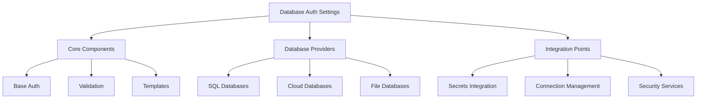

# Database Authentication Settings Requirements Specification

## 1. Overview

### 1.1 Purpose
This specification defines the requirements for a database authentication settings system that integrates with the Mountain Ash framework. The system will provide secure, flexible, and extensible authentication management for various database backends.

### 1.2 Scope


## 2. Core Requirements

### 2.1 Base Authentication Framework

#### REQ-BASE-001: Base Settings Class
- Must extend MountainAshBaseSettings
- Must support Pydantic validation
- Must implement post-initialization hooks
- Must support template string resolution

#### REQ-BASE-002: Configuration Sources
- Must support environment variables
- Must support configuration files
- Must support runtime parameters
- Must support secret store integration

#### REQ-BASE-003: Authentication Methods
- Must support username/password authentication
- Must support token-based authentication
- Must support certificate-based authentication
- Must support IAM/role-based authentication
- Must support connection string-based authentication

#### REQ-BASE-004: Validation Rules
- Must validate all credentials before use
- Must validate connection parameters
- Must support custom validation rules per database
- Must prevent insecure configurations

### 2.2 Security Requirements

#### REQ-SEC-001: Credential Protection
- Must never log credentials
- Must use SecretStr for sensitive data
- Must support encryption at rest
- Must support secure credential rotation

#### REQ-SEC-002: Integration Security
- Must integrate with secret management system
- Must support secure credential retrieval
- Must handle credential lifecycle
- Must support secure connection strings

#### REQ-SEC-003: Authentication Flow
- Must validate credentials before use
- Must support connection pooling
- Must handle authentication failures gracefully
- Must support credential refresh

#### REQ-SEC-004: Audit Support
- Must track authentication attempts
- Must support logging (without credentials)
- Must enable tracing of configuration sources
- Must support security policy enforcement

## 3. Provider-Specific Requirements

### 3.1 SQL Databases

#### REQ-SQL-001: MySQL Authentication
```python
class MySQLAuthRequirements:
    username: str
    password: SecretStr
    host: str
    port: int = 3306
    database: Optional[str]
    ssl_ca: Optional[str]
    ssl_cert: Optional[str]
    ssl_key: Optional[str]
```

#### REQ-SQL-002: PostgreSQL Authentication
```python
class PostgreSQLAuthRequirements:
    username: str
    password: SecretStr
    host: str
    port: int = 5432
    database: str
    ssl_mode: Optional[str]
    ssl_cert: Optional[str]
    application_name: Optional[str]
```

#### REQ-SQL-003: SQL Server Authentication
```python
class SQLServerAuthRequirements:
    username: Optional[str]
    password: Optional[SecretStr]
    host: str
    port: int = 1433
    database: Optional[str]
    windows_auth: bool = False
    trust_server_certificate: bool = False
```

### 3.2 Cloud Databases

#### REQ-CLOUD-001: Snowflake Authentication
```python
class SnowflakeAuthRequirements:
    username: str
    password: Optional[SecretStr]
    account: str
    warehouse: str
    database: Optional[str]
    schema: Optional[str]
    role: Optional[str]
    private_key: Optional[SecretStr]
```

#### REQ-CLOUD-002: BigQuery Authentication
```python
class BigQueryAuthRequirements:
    project_id: str
    dataset_id: Optional[str]
    service_account_info: Optional[Dict[str, Any]]
    service_account_file: Optional[str]
    credentials: Optional[Any]
```

#### REQ-CLOUD-003: Redshift Authentication
```python
class RedshiftAuthRequirements:
    cluster_identifier: str
    database: str
    user: Optional[str]
    password: Optional[SecretStr]
    iam_role: Optional[str]
    region: str
```

### 3.3 File Databases

#### REQ-FILE-001: SQLite Authentication
```python
class SQLiteAuthRequirements:
    database_path: str
    mode: Optional[str]
    uri: bool = False
    encryption_key: Optional[SecretStr]
```

#### REQ-FILE-002: DuckDB Authentication
```python
class DuckDBAuthRequirements:
    database_path: Optional[str]
    read_only: bool = False
    memory: bool = False
```

## 4. Integration Requirements

### 4.1 Connection String Management

#### REQ-CONN-001: Template System
- Must support template-based connection strings
- Must handle different database formats
- Must support parameter substitution
- Must validate generated strings

```python
class ConnectionStringTemplates:
    MYSQL_TEMPLATE = "mysql://{username}:{password}@{host}:{port}/{database}"
    POSTGRES_TEMPLATE = "postgresql://{username}:{password}@{host}:{port}/{database}"
    SNOWFLAKE_TEMPLATE = "snowflake://{username}:{password}@{account}/{database}/{schema}?warehouse={warehouse}"
```

#### REQ-CONN-002: Connection Options
- Must support connection pooling
- Must support timeout configuration
- Must support SSL/TLS options
- Must support driver-specific parameters

### 4.2 Secrets Integration

#### REQ-SECRET-001: Secret Store Integration
- Must integrate with MountainAsh secrets system
- Must support multiple secret providers
- Must handle secret rotation
- Must support secure secret retrieval

#### REQ-SECRET-002: Credential Management
- Must support credential caching
- Must handle credential expiration
- Must support credential refresh
- Must provide secure credential storage

### 4.3 Error Handling

#### REQ-ERROR-001: Authentication Errors
```python
class AuthenticationErrors:
    class InvalidCredentials(Exception): pass
    class ConnectionFailed(Exception): pass
    class ConfigurationError(Exception): pass
    class SecurityViolation(Exception): pass
```

#### REQ-ERROR-002: Error Recovery
- Must handle connection failures
- Must support retry policies
- Must provide meaningful error messages
- Must support fallback configurations

## 5. Validation Requirements

### 5.1 Configuration Validation

#### REQ-VAL-001: Basic Validation
- Must validate all required fields
- Must validate field types and formats
- Must validate connection parameters
- Must prevent invalid combinations

#### REQ-VAL-002: Security Validation
- Must validate SSL/TLS configurations
- Must validate credential formats
- Must validate security parameters
- Must enforce security policies

### 5.2 Runtime Validation

#### REQ-VAL-003: Connection Validation
- Must validate before connection attempts
- Must validate connection strings
- Must validate security requirements
- Must validate provider-specific requirements

## 6. Extension Requirements

### 6.1 Provider Extension

#### REQ-EXT-001: Custom Providers
- Must support custom database providers
- Must allow custom authentication methods
- Must support custom validation rules
- Must maintain security standards

#### REQ-EXT-002: Provider Interface
```python
class DatabaseAuthProvider:
    @abstractmethod
    def authenticate(self) -> bool: pass
    
    @abstractmethod
    def get_connection_params(self) -> Dict[str, Any]: pass
    
    @abstractmethod
    def validate_configuration(self) -> None: pass
```

### 6.2 Authentication Extension

#### REQ-EXT-003: Custom Authentication
- Must support custom authentication methods
- Must allow custom credential providers
- Must support custom validation rules
- Must maintain security standards

## 7. Testing Requirements

### 7.1 Validation Testing

#### REQ-TEST-001: Configuration Testing
- Must test all validation rules
- Must test error conditions
- Must test security requirements
- Must test provider-specific requirements

#### REQ-TEST-002: Integration Testing
- Must test secret store integration
- Must test connection management
- Must test error handling
- Must test security features

## 8. Documentation Requirements

#### REQ-DOC-001: Implementation Documentation
- Must provide implementation examples
- Must document security requirements
- Must document configuration options
- Must provide troubleshooting guides

#### REQ-DOC-002: API Documentation
- Must document public interfaces
- Must document configuration options
- Must document security considerations
- Must provide usage examples

Would you like me to:

1. Generate detailed implementation specifications for any specific component?
2. Create example code for a particular requirement?
3. Develop test specifications?
4. Elaborate on any specific requirement?

Please let me know how you'd like to proceed with implementing these requirements.