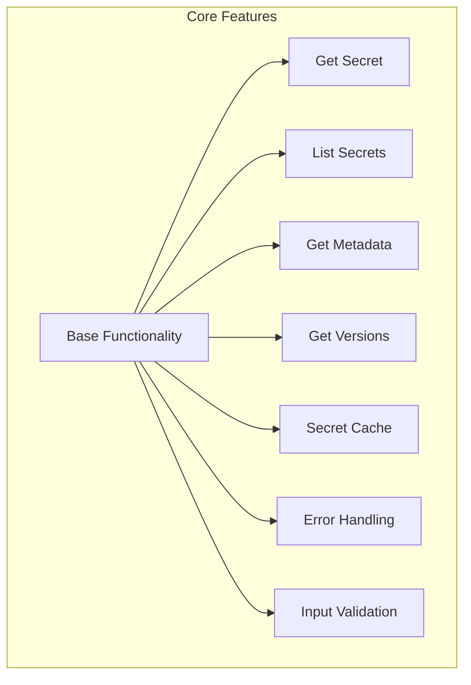
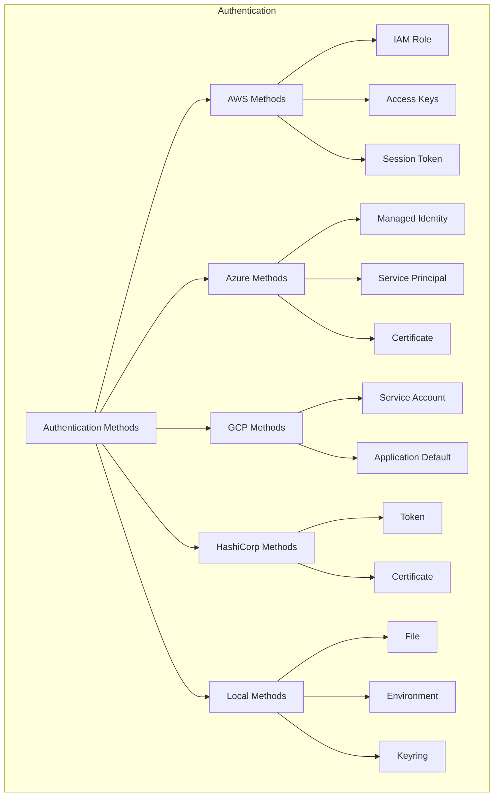
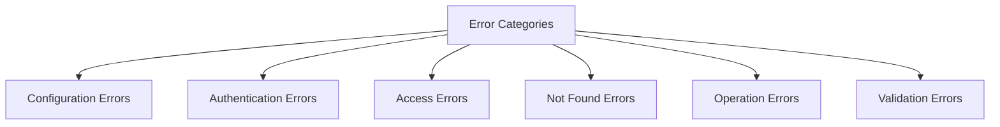

# Secrets Implementation Feature Comparison

## 1. Core Features Matrix

| Feature | AWS | Azure | GCP | HashiCorp | Local |
|---------|-----|-------|-----|-----------|-------|
| Get Secret | ✅ | ✅ | ✅ | ✅ | ✅ |
| List Secrets | ✅ | ✅ | ✅ | ✅ | ✅ |
| Get Metadata | ✅ | ✅ | ✅ | ✅ Partial¹ | ✅ |
| Get Versions | ✅ | ✅ | ✅ | ✅² | ❌ |
| Secret Cache | ✅ | ✅ | ✅ | ✅ | ✅ |
| Namespace Support | ✅ | ✅ | ✅ | ✅ | ✅ |
| Input Validation | ✅ | ✅ | ✅ | ✅ | ✅ |

¹ KV v2 only
² KV v2 only

## 2. Authentication Methods

| Auth Method | AWS | Azure | GCP | HashiCorp | Local |
|-------------|-----|-------|-----|-----------|-------|
| IAM/Role Based | ✅ | ✅³ | ✅ | ❌ | ❌ |
| Key Based | ✅ | ✅ | ✅ | ✅ | ❌ |
| Certificate | ❌ | ✅ | ❌ | ✅ | ❌ |
| Token Based | ✅ | ❌ | ❌ | ✅ | ❌ |
| Identity Based | ❌ | ✅ | ❌ | ❌ | ❌ |
| Environment | ✅ | ✅ | ✅ | ✅ | ✅ |

³ Via Managed Identity

## 3. Security Features

| Feature | AWS | Azure | GCP | HashiCorp | Local |
|---------|-----|-------|-----|-----------|-------|
| SSL/TLS Support | ✅ | ✅ | ✅ | ✅ | N/A |
| Custom CA Support | ✅ | ✅ | ✅ | ✅ | N/A |
| Secret Encryption | ✅ | ✅ | ✅ | ✅ | ✅ |
| Value Protection⁴ | ✅ | ✅ | ✅ | ✅ | ✅ |
| Cache Security | ✅ | ✅ | ✅ | ✅ | ✅ |

⁴ Using SecretStr

## 4. Provider-Specific Features

### 4.1 AWS Features
- Role assumption
- Version stages (AWSCURRENT, AWSPENDING)
- KMS integration
- Regional endpoints
- Tag-based filtering

### 4.2 Azure Features
- Managed Identity integration
- Certificate-based auth
- Soft delete handling
- Azure AD integration
- Tags support

### 4.3 GCP Features
- Project isolation
- Service account support
- Labels support
- Customer managed encryption
- Resource hierarchy

### 4.4 HashiCorp Features
- KV v1 and v2 support
- Multiple mount points
- Custom paths
- Certificate auth
- Namespace isolation

### 4.5 Local Features
- Multiple storage backends (File/Keyring/Env)
- Simple encryption
- Filesystem isolation
- Environment variable support

## 5. Configuration Options

| Option | AWS | Azure | GCP | HashiCorp | Local |
|--------|-----|-------|-----|-----------|-------|
| Custom Endpoint | ✅ | ✅ | ✅ | ✅ | N/A |
| Timeout Config | ✅ | ✅ | ✅ | ✅ | N/A |
| Retry Policy | ✅ | ✅ | ✅ | ✅ | ✅ |
| Connection Pool | ✅ | ✅ | ✅ | ✅ | N/A |
| Cache TTL | ✅ | ✅ | ✅ | ✅ | ✅ |

## 6. Error Handling

All implementations provide consistent error handling for:

| Error Type | AWS | Azure | GCP | HashiCorp | Local |
|------------|-----|-------|-----|-----------|-------|
| Configuration | ✅ | ✅ | ✅ | ✅ | ✅ |
| Authentication | ✅ | ✅ | ✅ | ✅ | ✅ |
| Access Denied | ✅ | ✅ | ✅ | ✅ | ✅ |
| Not Found | ✅ | ✅ | ✅ | ✅ | ✅ |
| Operation | ✅ | ✅ | ✅ | ✅ | ✅ |
| Validation | ✅ | ✅ | ✅ | ✅ | ✅ |

## 7. Performance Features

| Feature | AWS | Azure | GCP | HashiCorp | Local |
|---------|-----|-------|-----|-----------|-------|
| Caching | ✅ | ✅ | ✅ | ✅ | ✅ |
| Connection Pooling | ✅ | ✅ | ✅ | ✅ | N/A |
| Retry Mechanism | ✅ | ✅ | ✅ | ✅ | ✅ |
| Async Support⁵ | ❌ | ❌ | ❌ | ❌ | ❌ |

⁵ Could be added in future

Would you like me to:
1. Add more detail about any specific feature?
2. Compare additional aspects?
3. Create implementation recommendations for specific use cases?
4. Provide guidance on provider selection?