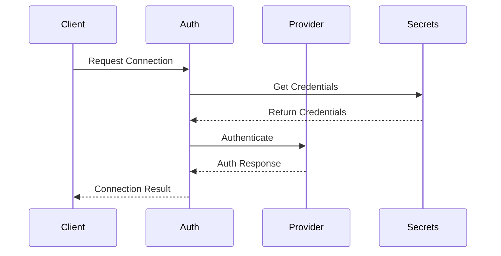
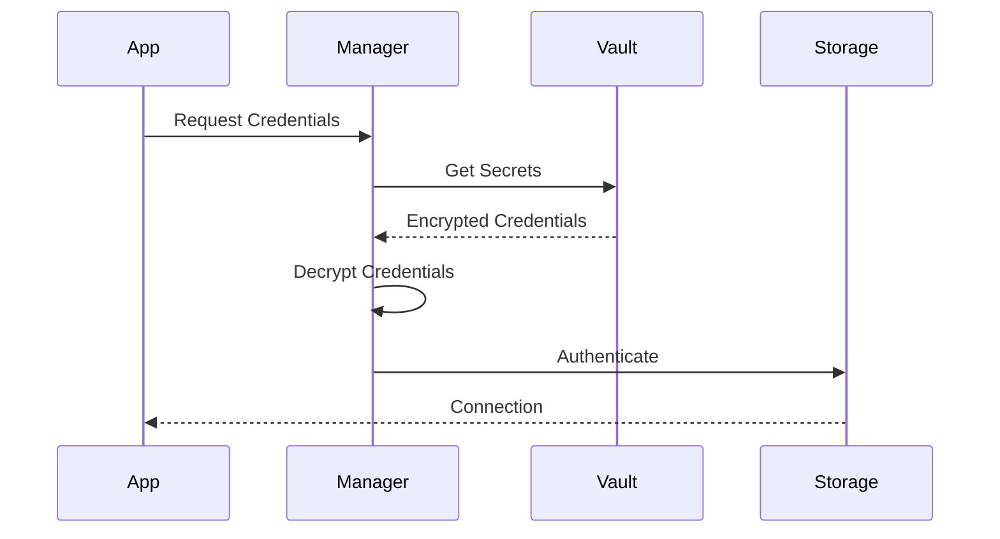

### 7.3 Testing Requirements (continued)

#### REQ-TEST-002: Test Categories (continued)

1. Authentication Tests
   - Credential validation
   - Authentication flow verification
   - Token refresh mechanisms
   - Session management
   - Multi-factor authentication handling
   - Error case validation

2. Connection Tests
```python
class TestStorageConnection:
    """Test cases for storage connections"""
    
    async def test_connection_establishment(self):
        """Test basic connection establishment"""
        pass
    
    async def test_connection_pooling(self):
        """Test connection pool behavior"""
        pass
    
    async def test_connection_recovery(self):
        """Test connection recovery after failure"""
        pass
    
    async def test_concurrent_connections(self):
        """Test multiple concurrent connections"""
        pass
```

3. Security Tests
```python
class TestStorageSecurity:
    """Test cases for storage security"""
    
    def test_credential_encryption(self):
        """Test credential encryption at rest"""
        pass
    
    def test_secure_communication(self):
        """Test secure communication channels"""
        pass
    
    def test_authentication_timeout(self):
        """Test authentication timeout handling"""
        pass
    
    def test_credential_rotation(self):
        """Test credential rotation process"""
        pass
```

4. Performance Tests
```python
class TestStoragePerformance:
    """Test cases for storage performance"""
    
    async def test_connection_speed(self):
        """Test connection establishment speed"""
        pass
    
    async def test_concurrent_operations(self):
        """Test concurrent operation handling"""
        pass
    
    async def test_resource_usage(self):
        """Test resource utilization"""
        pass
    
    async def test_connection_pool_scaling(self):
        """Test connection pool scaling"""
        pass
```

#### REQ-TEST-003: Mock Testing Framework
```python
class MockStorageProvider:
    """Mock storage provider for testing"""
    
    def __init__(self, config: Dict[str, Any]):
        self.config = config
        self.calls = []
        
    async def authenticate(self) -> bool:
        """Mock authentication"""
        self.calls.append(("authenticate", {}))
        return True
        
    async def validate_connection(self) -> bool:
        """Mock connection validation"""
        self.calls.append(("validate_connection", {}))
        return True
```

#### REQ-TEST-004: Testing Utilities
```python
class StorageTestUtils:
    """Utilities for storage testing"""
    
    @staticmethod
    def create_test_credentials() -> Dict[str, Any]:
        """Create test credentials"""
        pass
    
    @staticmethod
    def setup_test_environment() -> None:
        """Setup test environment"""
        pass
    
    @staticmethod
    def cleanup_test_resources() -> None:
        """Cleanup test resources"""
        pass
```

### 7.4 Documentation Requirements

#### REQ-DOC-001: Code Documentation
- All public methods must have docstrings
- Type hints required for all parameters
- Example usage in docstrings
- Performance considerations noted
- Security considerations documented
- Error handling explained

Example:
```python
def authenticate_storage(
    provider: str,
    credentials: Dict[str, Any],
    *,
    timeout: Optional[float] = None,
    retry_count: int = 3
) -> bool:
    """
    Authenticate with a storage provider.
    
    Args:
        provider: Storage provider identifier
        credentials: Authentication credentials
        timeout: Optional timeout in seconds
        retry_count: Number of retry attempts
        
    Returns:
        bool: True if authentication successful
        
    Raises:
        StorageAuthError: If authentication fails
        StorageConfigError: If configuration is invalid
        
    Example:
        >>> credentials = {
        ...     "access_key": "key",
        ...     "secret_key": "secret"
        ... }
        >>> authenticate_storage("s3", credentials)
        True
        
    Notes:
        - Implements exponential backoff for retries
        - Credentials are automatically encrypted at rest
        - Supports MFA if provider requires it
    """
```

#### REQ-DOC-002: Security Documentation
1. Authentication Flows


2. Credential Handling


#### REQ-DOC-003: API Documentation
- REST API specifications
- Authentication flows
- Error responses
- Rate limiting
- Pagination
- Versioning
- Request/response examples

### 8. Deployment Requirements

#### REQ-DEPLOY-001: Environment Configuration
```python
class StorageEnvironment:
    """Storage environment configuration"""
    
    # Environment Settings
    ENV_TYPE: str = Field(...)  # development, staging, production
    REGION: str = Field(...)
    DEBUG: bool = Field(default=False)
    
    # Security Settings
    ENCRYPT_AT_REST: bool = Field(default=True)
    AUDIT_LOGGING: bool = Field(default=True)
    
    # Performance Settings
    MAX_CONNECTIONS: int = Field(default=100)
    CONNECTION_TIMEOUT: int = Field(default=30)
```

#### REQ-DEPLOY-002: Monitoring Requirements
```python
class StorageMonitoring:
    """Storage monitoring configuration"""
    
    # Metrics
    METRICS_ENABLED: bool = Field(default=True)
    METRICS_INTERVAL: int = Field(default=60)
    
    # Alerts
    ALERT_ON_ERROR: bool = Field(default=True)
    ALERT_THRESHOLD: int = Field(default=3)
    
    # Logging
    LOG_LEVEL: str = Field(default="INFO")
    LOG_FORMAT: str = Field(default="json")
```

### 9. Migration Guidelines

#### REQ-MIG-001: Version Migration
```python
class StorageMigration:
    """Storage migration utilities"""
    
    async def backup_configuration(self) -> str:
        """Backup current configuration"""
        pass
    
    async def migrate_configuration(
        self,
        target_version: str
    ) -> bool:
        """Migrate to new version"""
        pass
    
    async def validate_migration(self) -> bool:
        """Validate migration success"""
        pass
    
    async def rollback_migration(self) -> bool:
        """Rollback failed migration"""
        pass
```

#### REQ-MIG-002: Data Migration
- Credential format updates
- Connection string migrations
- Security policy updates
- Configuration schema changes

### 10. Performance Requirements

#### REQ-PERF-001: Connection Performance
```python
class ConnectionPerformance:
    """Connection performance requirements"""
    
    # Timeouts
    CONNECT_TIMEOUT: float = 5.0  # seconds
    READ_TIMEOUT: float = 30.0    # seconds
    WRITE_TIMEOUT: float = 30.0   # seconds
    
    # Pooling
    MIN_POOL_SIZE: int = 5
    MAX_POOL_SIZE: int = 50
    MAX_OVERFLOW: int = 10
    
    # Concurrency
    MAX_CONCURRENT_REQUESTS: int = 100
    RATE_LIMIT: int = 1000  # requests per second
```

#### REQ-PERF-002: Resource Limits
```python
class ResourceLimits:
    """Resource usage limits"""
    
    # Memory Limits
    MAX_MEMORY_MB: int = 1024
    MAX_CACHE_SIZE_MB: int = 256
    
    # CPU Limits
    MAX_CPU_PERCENT: float = 75.0
    
    # Network Limits
    MAX_BANDWIDTH_MBPS: int = 100
    MAX_CONNECTIONS_PER_HOST: int = 20
```

### 11. Maintenance Requirements

#### REQ-MAINT-001: Health Checks
```python
class StorageHealthCheck:
    """Storage health check utilities"""
    
    async def check_connection_health(self) -> Dict[str, Any]:
        """Check connection health"""
        pass
    
    async def check_credential_health(self) -> Dict[str, Any]:
        """Check credential health"""
        pass
    
    async def check_performance_health(self) -> Dict[str, Any]:
        """Check performance metrics"""
        pass
```

#### REQ-MAINT-002: Maintenance Operations
```python
class StorageMaintenance:
    """Storage maintenance operations"""
    
    async def cleanup_expired_sessions(self) -> int:
        """Cleanup expired sessions"""
        pass
    
    async def rotate_encryption_keys(self) -> bool:
        """Rotate encryption keys"""
        pass
    
    async def optimize_connection_pool(self) -> Dict[str, Any]:
        """Optimize connection pool"""
        pass
```

### 12. Compliance Requirements

#### REQ-COMP-001: Audit Trail
```python
class StorageAudit:
    """Storage audit requirements"""
    
    def log_access_attempt(
        self,
        user: str,
        resource: str,
        action: str,
        success: bool
    ) -> None:
        """Log access attempt"""
        pass
    
    def generate_audit_report(
        self,
        start_date: datetime,
        end_date: datetime
    ) -> Dict[str, Any]:
        """Generate audit report"""
        pass
```

#### REQ-COMP-002: Compliance Checks
```python
class ComplianceCheck:
    """Compliance check utilities"""
    
    def check_encryption_compliance(self) -> bool:
        """Check encryption compliance"""
        pass
    
    def check_authentication_compliance(self) -> bool:
        """Check authentication compliance"""
        pass
    
    def check_audit_compliance(self) -> bool:
        """Check audit log compliance"""
        pass
```

Would you like me to provide more details about any specific section or move on to creating the implementation specifications for any particular component?