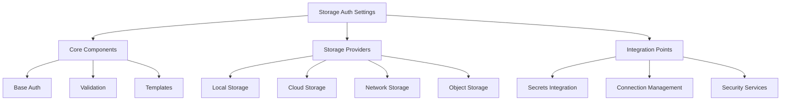

# Storage Authentication System Specification

## 1. Overview

### 1.1 Purpose
This specification defines the requirements for a storage authentication settings system that integrates with the Mountain Ash framework. The system will provide secure, flexible, and extensible authentication management for various storage backends.

### 1.2 Scope


## 2. Core Requirements

### 2.1 Base Authentication Framework

#### REQ-BASE-001: Base Settings Class
- Must extend MountainAshBaseSettings
- Must support Pydantic validation
- Must implement post-initialization hooks
- Must support template string resolution
- Must integrate with existing auth patterns

#### REQ-BASE-002: Configuration Sources
- Must support environment variables
- Must support configuration files
- Must support runtime parameters
- Must support secret store integration
- Must handle credentials securely

#### REQ-BASE-003: Authentication Methods
- Must support key/token-based authentication
- Must support certificate-based authentication
- Must support IAM/role-based authentication
- Must support OAuth 2.0 flows
- Must support connection string-based authentication

#### REQ-BASE-004: Validation Rules
- Must validate all credentials before use
- Must validate connection parameters 
- Must support custom validation rules per provider
- Must prevent insecure configurations
- Must validate file/folder permissions

### 2.2 Security Requirements

#### REQ-SEC-001: Credential Protection
```python
class StorageAuthBase(MountainAshBaseSettings):
    """Base class for storage authentication settings"""
    
    # Security Settings
    CREDENTIALS_KEY: Optional[SecretStr] = Field(default=None)
    ENCRYPTION_KEY: Optional[SecretStr] = Field(default=None)
    ACCESS_TOKEN: Optional[SecretStr] = Field(default=None)
    REFRESH_TOKEN: Optional[SecretStr] = Field(default=None)
    
    # Security Configuration
    ENCRYPTION_ENABLED: bool = Field(default=True)
    ENCRYPTION_ALGORITHM: str = Field(default="AES-256-GCM")
    REQUIRE_SECURE_TRANSPORT: bool = Field(default=True)
```

#### REQ-SEC-002: Integration Security
- Must integrate with secret management system
- Must support secure credential retrieval
- Must handle credential lifecycle
- Must support credential rotation
- Must validate security configurations

#### REQ-SEC-003: Authentication Flow
- Must validate credentials before use
- Must support connection pooling where applicable
- Must handle authentication failures gracefully
- Must support credential refresh
- Must implement retry logic

#### REQ-SEC-004: Audit Support
- Must track authentication attempts
- Must support logging (without credentials)
- Must track access patterns
- Must enable compliance monitoring
- Must support security policy enforcement

## 3. Provider-Specific Requirements

### 3.1 Local Storage

#### REQ-LOCAL-001: Local Filesystem Settings
```python
class LocalStorageAuthSettings(StorageAuthBase):
    """Local filesystem authentication settings"""
    
    # Base Settings
    ROOT_PATH: str = Field(...)
    CREATE_DIRS: bool = Field(default=False)
    
    # Permission Settings
    REQUIRED_PERMISSIONS: Set[str] = Field(default={"read", "write"})
    UMASK: Optional[int] = Field(default=None)
    
    # Security Settings
    ENCRYPTION_ENABLED: bool = Field(default=False)
    ENCRYPTION_KEY_FILE: Optional[str] = Field(default=None)
    
    # Performance Settings
    USE_MMAP: bool = Field(default=False)
    BUFFER_SIZE: int = Field(default=8192)
```

### 3.2 Cloud Storage

#### REQ-CLOUD-001: AWS S3 Settings
```python
class S3StorageAuthSettings(StorageAuthBase):
    """AWS S3 authentication settings"""
    
    # AWS Settings
    REGION: str = Field(...)
    BUCKET: str = Field(...)
    ACCESS_KEY_ID: Optional[str] = Field(default=None)
    SECRET_ACCESS_KEY: Optional[SecretStr] = Field(default=None)
    SESSION_TOKEN: Optional[SecretStr] = Field(default=None)
    
    # S3 Specific
    ENDPOINT_URL: Optional[str] = Field(default=None)
    PATH_STYLE: bool = Field(default=False)
    ADDRESSING_STYLE: str = Field(default="auto")
    
    # Performance
    MAX_POOL_CONNECTIONS: int = Field(default=10)
    TRANSFER_CONFIG: Optional[Dict[str, Any]] = Field(default=None)
```

#### REQ-CLOUD-002: Azure Storage Settings
```python
class AzureStorageAuthSettings(StorageAuthBase):
    """Azure Storage authentication settings"""
    
    # Azure Settings
    ACCOUNT_NAME: str = Field(...)
    ACCOUNT_KEY: Optional[SecretStr] = Field(default=None)
    CONNECTION_STRING: Optional[SecretStr] = Field(default=None)
    
    # Container Settings
    CONTAINER_NAME: str = Field(...)
    CREATE_CONTAINER: bool = Field(default=False)
    
    # Authentication
    AUTH_METHOD: str = Field(default="key")  # key, sas, connection_string
    SAS_TOKEN: Optional[SecretStr] = Field(default=None)
    
    # Performance
    MAX_CHUNK_SIZE: int = Field(default=4 * 1024 * 1024)
    MAX_CONCURRENCY: int = Field(default=4)
```

#### REQ-CLOUD-003: GCS Settings
```python
class GCSStorageAuthSettings(StorageAuthBase):
    """Google Cloud Storage authentication settings"""
    
    # GCP Settings
    PROJECT_ID: str = Field(...)
    BUCKET_NAME: str = Field(...)
    
    # Authentication
    SERVICE_ACCOUNT_INFO: Optional[Dict[str, Any]] = Field(default=None)
    SERVICE_ACCOUNT_FILE: Optional[str] = Field(default=None)
    
    # Client Settings
    RETRY_TIMEOUT: float = Field(default=120.0)
    NUM_RETRIES: int = Field(default=3)
    
    # Performance
    CHUNK_SIZE: int = Field(default=256 * 1024)
    READ_TIMEOUT: Optional[float] = Field(default=None)
```

### 3.3 Network Storage

#### REQ-NET-001: SFTP Settings
```python
class SFTPStorageAuthSettings(StorageAuthBase):
    """SFTP authentication settings"""
    
    # Connection Settings
    HOST: str = Field(...)
    PORT: int = Field(default=22)
    USERNAME: str = Field(...)
    
    # Authentication
    AUTH_METHOD: str = Field(default="password")  # password, key, agent
    PASSWORD: Optional[SecretStr] = Field(default=None)
    PRIVATE_KEY_PATH: Optional[str] = Field(default=None)
    PRIVATE_KEY_PASSPHRASE: Optional[SecretStr] = Field(default=None)
    
    # SSH Settings
    KNOWN_HOSTS_FILE: Optional[str] = Field(default=None)
    COMPRESS: bool = Field(default=True)
    
    # Performance
    BUFFER_SIZE: int = Field(default=32768)
    TIMEOUT: float = Field(default=30.0)
```

#### REQ-NET-002: SMB Settings
```python
class SMBStorageAuthSettings(StorageAuthBase):
    """SMB/CIFS authentication settings"""
    
    # Connection Settings
    SERVER: str = Field(...)
    SHARE: str = Field(...)
    DOMAIN: Optional[str] = Field(default=None)
    
    # Authentication
    USERNAME: Optional[str] = Field(default=None)
    PASSWORD: Optional[SecretStr] = Field(default=None)
    
    # Protocol Settings
    VERSION: str = Field(default="3.0")
    ENCRYPTION: bool = Field(default=True)
    SIGN_OPTIONS: str = Field(default="when_required")
    
    # Performance
    TIMEOUT: int = Field(default=60)
    BUFFER_SIZE: int = Field(default=16384)
```

### 3.4 Object Storage

#### REQ-OBJ-001: MinIO Settings
```python
class MinIOStorageAuthSettings(StorageAuthBase):
    """MinIO authentication settings"""
    
    # Connection Settings
    ENDPOINT: str = Field(...)
    BUCKET: str = Field(...)
    SECURE: bool = Field(default=True)
    
    # Authentication
    ACCESS_KEY: str = Field(...)
    SECRET_KEY: SecretStr = Field(...)
    
    # Client Settings
    REGION: Optional[str] = Field(default=None)
    HTTP_CLIENT: Optional[str] = Field(default=None)
    
    # Performance
    CONN_POOL_SIZE: int = Field(default=10)
    RETRY_COUNT: int = Field(default=3)
```

## 4. Integration Requirements

### 4.1 Connection Management

#### REQ-CONN-001: Connection Factory
```python
class StorageConnectionFactory:
    """Factory for creating storage connections"""
    
    @classmethod
    def create_connection(
        cls,
        provider_type: str,
        settings: StorageAuthBase
    ) -> StorageConnection:
        """Create appropriate storage connection"""
        pass
    
    @classmethod
    def validate_connection(
        cls,
        connection: StorageConnection
    ) -> bool:
        """Validate storage connection"""
        pass
```

#### REQ-CONN-002: Connection Pool
```python
class StorageConnectionPool:
    """Manage storage connections"""
    
    def acquire(self) -> StorageConnection:
        """Get connection from pool"""
        pass
    
    def release(self, connection: StorageConnection) -> None:
        """Return connection to pool"""
        pass
    
    def health_check(self) -> Dict[str, Any]:
        """Check pool health"""
        pass
```

### 4.2 Error Handling

#### REQ-ERROR-001: Storage Exceptions
```python
class StorageAuthError(Exception):
    """Base exception for storage authentication errors"""
    pass

class StorageConnectionError(StorageAuthError):
    """Connection-related errors"""
    pass

class StorageCredentialError(StorageAuthError):
    """Credential-related errors"""
    pass

class StoragePermissionError(StorageAuthError):
    """Permission-related errors"""
    pass
```

#### REQ-ERROR-002: Retry Handling
```python
class StorageRetryPolicy:
    """Define retry behavior for storage operations"""
    
    MAX_RETRIES: int = 3
    RETRY_DELAYS: List[float] = [1.0, 2.0, 4.0]
    
    def should_retry(self, error: Exception) -> bool:
        """Determine if operation should be retried"""
        pass
    
    def get_retry_delay(self, attempt: int) -> float:
        """Get delay for retry attempt"""
        pass
```

### 4.3 Event System

#### REQ-EVENT-001: Storage Events
```python
class StorageEvent:
    """Base class for storage events"""
    timestamp: datetime
    provider: str
    operation: str
    status: str
    details: Dict[str, Any]

class StorageAuthEvent(StorageEvent):
    """Authentication-related events"""
    auth_method: str
    username: str
    success: bool
```

## 5. Security Requirements

### 5.1 Authentication Methods

#### REQ-AUTH-001: Method Support
Each storage provider must support appropriate authentication methods:

1. Local Storage
   - File permissions
   - User/group ownership
   - Access control lists
   - File encryption

2. Cloud Storage
   - API keys
   - IAM roles
   - Service accounts
   - OAuth2 flows
   - Temporary credentials

3. Network Storage
   - Username/password
   - SSH keys
   - Certificates
   - Kerberos tickets
   - Domain authentication

4. Object Storage
   - Access/secret keys
   - IAM integration
   - Token-based auth
   - Multi-factor auth

### 5.2 Credential Management

#### REQ-CRED-001: Credential Handling
```python
class CredentialManager:
    """Manage storage credentials"""
    
    def get_credentials(self, provider: str) -> Dict[str, Any]:
        """Get credentials for provider"""
        pass
    
    def rotate_credentials(self, provider: str) -> None:
        """Rotate provider credentials"""
        pass
    
    def validate_credentials(self, provider: str) -> bool:
        """Validate provider credentials"""
        pass
```

## 6. Extension Requirements

### 6.1 Custom Providers

#### REQ-EXT-001: Provider Interface
```python
class StorageProvider(Protocol):
    """Protocol for storage providers"""
    
    def authenticate(self) -> bool:
        """Authenticate with storage"""
        ...
    
    def validate_connection(self) -> bool:
        """Validate storage connection"""
        ...
    
    def get_capabilities(self) -> Set[str]:
        """Get provider capabilities"""
        ...
```

#### REQ-EXT-002: Provider Registration
```python
class StorageProviderRegistry:
    """Registry for storage providers"""
    
    @classmethod
    def register_provider(
        cls,
        provider_type: str,
        provider_class: Type[StorageProvider]
    ) -> None:
        """Register new storage provider"""
        pass
    
    @classmethod
    def get_provider(
        cls,
        provider_type: str
    ) -> Type[StorageProvider]:
        """Get registered provider"""
        pass
```

## 7. Implementation Guidelines

### 7.1 Code Organization
```
mountainash_settings/auth/storage/
├── __init__.py
├── base.py                    # Base storage auth classes
├── constants.py              # Storage-related constants
├── exceptions.py             # Storage-specific exceptions
├── providers/
│   ├── __init__.py
│   ├── local.py
│   ├── cloud/
│   │   ├── __init__.py
│   │   ├── s3.py
│   │   ├── azure.py
│   │   └── gcs.py
│   ├── network/
│   │   ├── __init__.py
│   │   ├── sftp.py
│   │   └── smb.py
│   └── object/
│       ├── __init__.py
│       └── minio.py
├── templates.py              # Connection string templates
└── utils/
    ├── __init__.py
    ├── connection.py
    ├── security.py
    └── validation.py
```

### 7.2 Dependencies
Required Python packages:
- boto3 (AWS S3)
- azure-storage-blob (Azure Storage)
- google-cloud-storage (GCS)
- paramiko (SFTP)
- smbprotocol (SMB)
- minio (MinIO)
- cryptography (encryption)
- python-jose (JWT handling)
- requests (HTTP client)

### 7.3 Testing Requirements

#### REQ-TEST-001: Test Coverage
- Unit tests for all provider implementations
- Integration tests with actual storage services
- Security testing for credential handling
- Performance testing for connection pooling
- Stress testing for concurrent access
- Mock testing for offline development

#### REQ-TEST-002: Test Categories
1. Authentication Tests
   - Credential validation
   